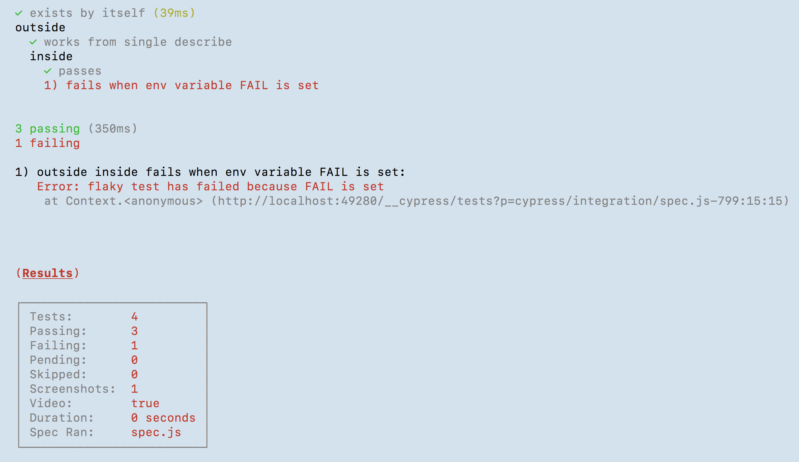
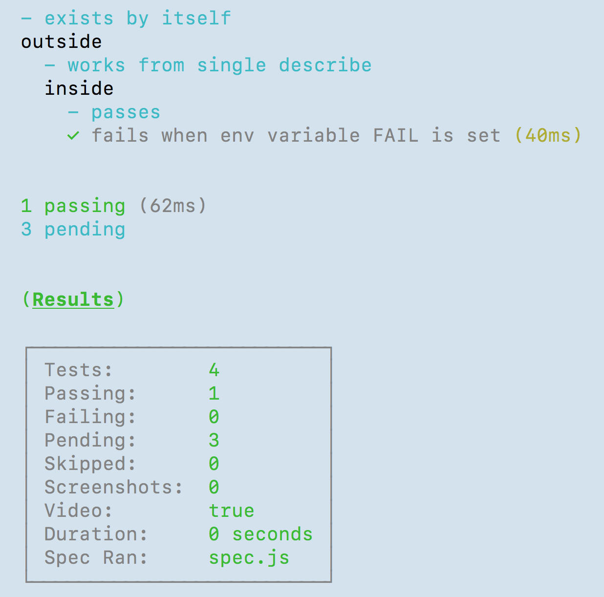

# cypress-retry

> Retry just the failed [Cypress.io][cypress] tests using [Cypress module API][module api] and [AST rewriting][ast]

First this script runs all tests in a given spec file. If any tests fail, these tests are returned by the module API. The script parses the spec file source into AST and changes all passing tests from `it(...)` to `it.skip(...)`, and saves the updated spec file. Then it runs the spec again - and now only the failed tests should run. Then it restores the original spec back to full.

## Example

First run - single test has failed



The script has found the failed tests in the spec file

```
failures: 1
failed test titles:
outside,inside,fails when env variable FAIL is set
found test [ 'outside', 'inside', 'passes' ]
should skip this test
found test [ 'outside', 'inside', 'fails when env variable FAIL is set' ]
found test [ 'outside', 'works from single describe' ]
should skip this test
found test [ 'exists by itself' ]
should skip this test
```

Once all tests but one test have been switched to `it.skip`, the tests are retried - this time without `env.FAIL=1` variable and the previously failing test is passing. Notice how all other tests are "pending", meaning they have been skipped by the test runner.



## Debugging

Run with `DEBUG=cypress-retry` environment variable to see additional debug output.

[cypress]: https://www.cypress.io
[module api]: https://on.cypress.io/module-api
[ast]: https://glebbahmutov.com/blog/tags/ast/
